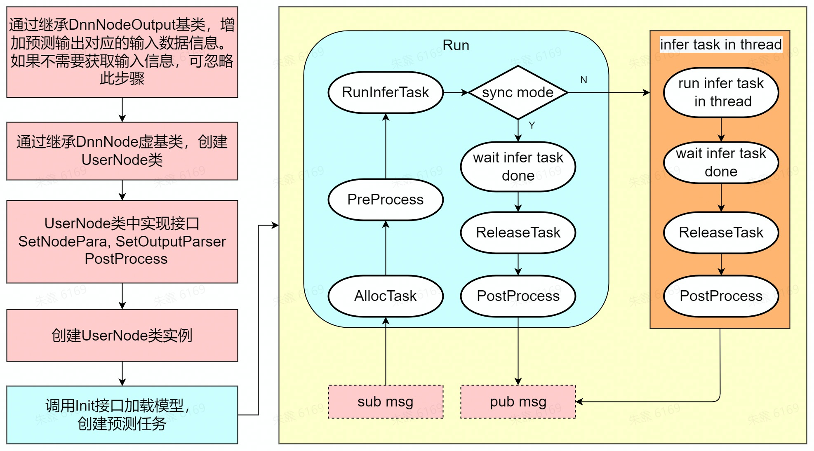

Getting Started with Dnn Node
=======


# Intro

通过阅读本文档，用户可以在地平线X3开发板上使用模型和图像数据利用BPU处理器进行模型推理，并处理解析后的模型输出。

Dnn Node package是地平线机器人开发平台的一部分，基于地平线EasyDNN和ROS2 Node进行二次开发，为应用开发提供更简单易用的模型集成开发接口，包括模型管理、基于模型描述的输入处理及结果解析，以及模型输出内存分配管理等功能。

Dnn Node package中的DnnNode是一个虚基类，定义了模型集成开发的数据结构和接口，用户需要继承DnnNode类并实现前后处理和配置接口。

# Build

## Dependency

具体请参考dnn_node_deps中版本说明。

- dnn:1.5.1
- easydnn:0.3.3
- opencv:3.4.5
- hobotlog:1.0.5
- rapidjson:1.1.0

## 开发环境

- 编程语言: C/C++
- 开发平台: X3/X86
- 系统版本：Ubuntu 20.0.4
- 编译工具链:Linux GCC 9.3.0/Linaro GCC 9.3.0

## package说明

源码包含dnn_node和dnn_node_example两个package，其中dnn_node_example是dnn_node的使用示例package。

dnn_node编译完成后，dnn_node头文件和动态库，以及其依赖安装在install/dnn_node/路径。

dnn_node_example编译完成后，可执行程序以及其依赖安装在install/dnn_node_example/路径，具体使用方法参考dnn_node_example pkg中的README.md。

## 编译

编译环境确认：

- 当前编译终端已设置ROS环境变量：`source /opt/ros/foxy/setup.bash`。
-  已安装ROS2编译工具colcon。安装的ROS不包含编译工具colcon，需要手动安装colcon。colcon安装命令：`apt update; apt install python3-colcon-common-extensions`

编译：

- 同时编译dnn_node和dnn_node_example两个package：`colcon build`
- 只编译dnn_node package：`colcon build --packages-select dnn_node`
- 只编译dnn_node_example package：`colcon build --packages-select dnn_node_example`

编译和运行dnn_node_example package依赖cv_bridge等ROS开源的package，需要手动安装，具体安装方法：

```cpp
# 方法1，直接使用apt安装，以cv_bridge安装举例
sudo apt-get install ros-foxy-cv-bridge -y

# 方法2，使用rosdep检查并自动安装pkg编译的依赖项
# 安装ros pkg依赖下载⼯具rosdep
sudo apt-get install python3-pip
sudo pip install rosdep
sudo rosdep init
rosdep update
# 在ros的⼯程路径下执⾏安装依赖，需要指定pkg所在路径。默认为所有pkg安装依赖，也可以指定为某个pkg安装依赖
rosdep install -i --from-path . --rosdistro foxy -y
```


# Usage

用户需要继承DnnNode虚基类并实现前后处理和配置接口。

dnn node package中的数据和接口说明详见使用手册：docs/API-Manual/API-Manual.md

## 使用流程



## 模型输出解析方法

通过继承接口`int SetOutputParser()`设置模型输出的解析方法。

地平线EasyDnn预测库中预定义了一些模型的解析方法，如人体/人头/人脸/人手检测框的解析，此外还支持分类等模型的解析。支持的解析方法类型详见dnn_node/dnn_node_deps/hobot/easy_dnn/include/easy_dnn/output_parser/。

用户可以用过继承SingleBranchOutputParser/MultiBranchOutputParser类，实现Parse接口来自定义模型的解析方法。

## 预测任务管理

对于每次预测，用户都需要通过`TaskId AllocTask(int timeout_ms = -1)`接口申请执行预测的任务，预测结束后，使用`int ReleaseTask(const TaskId&)`接口释放预测任务。使用申请到的TaskId通过接口`std::shared_ptr<Task> GetTask(const TaskId&)`获取申请到的预测任务。

一个model支持由多个task执行，在dnn node初始化阶段根据用户配置的task数量预先创建好预测task，使用AllocTask/ReleaseTask申请/释放task时是从task池中申请/释放。

task数量是通过DnnNodePara中的task_num参数指定。一般对于同步预测模式，task_num设置为1，对于异步预测模式，task_num设置为大于1。

## 同步和异步预测

dnn node支持同步和异步两种预测方式。在调用预测接口时通过is_sync_mode参数指定，默认为同步模式：

`int RunInferTask(std::vector<std::shared_ptr<DNNResult>> &sync_outputs, const TaskId& task_id, bool is_sync_mode = true, const int timeout_ms = 1000);`

同步预测：用户调用RunInferTask接口进行预测后，接口内部阻塞等待预测结果返回（预测完成或者预测报错），之后用户主动使用ReleaseTask接口释放task，以及调用PostProcess接口处理解析后的模型输出。

异步预测：用户调用RunInferTask接口进行预测后，接口内部使用线程池处理预测，预测任务送入线程池后不等待预测结束直接返回。当预测结果返回时（预测完成或者预测报错），在dnn node内部使用ReleaseTask接口释放task，并通过PostProcess接口回调解析后的模型输出。

