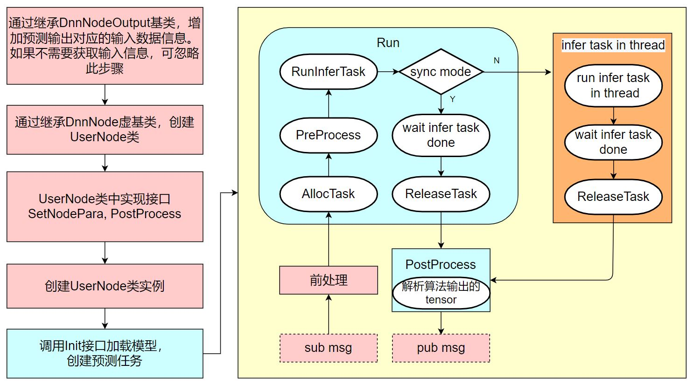

[English](./README.md) | 简体中文

Getting Started with Dnn Node
=======


# 功能介绍

通过阅读本文档，用户可以在地平线X3开发板上使用模型和图像数据利用BPU处理器进行模型推理，并处理解析后的模型输出。

Dnn Node package是地平线机器人开发平台的一部分，基于地平线EasyDNN和ROS2 Node进行二次开发，为应用开发提供更简单易用的模型集成开发接口，包括模型管理、基于模型描述的输入处理及结果解析，以及模型输出内存分配管理等功能。

Dnn Node package中的DnnNode是一个虚基类，定义了模型集成开发的数据结构和接口，用户需要继承DnnNode类并实现前后处理和配置接口。

# 开发环境

- 编程语言: C/C++
- 开发平台: X3/Rdkultra/X86
- 系统版本：Ubuntu 20.04/Ubuntu 22.04
- 编译工具链:Linux GCC 9.3.0/Linaro GCC 9.3.0

# 编译

- X3版本：支持在X3 Ubuntu系统上编译和在PC上使用docker交叉编译两种方式。

- Rdkultra版本：支持在Rdkultra Ubuntu系统上编译和在PC上使用docker交叉编译两种方式。

- X86版本：支持在X86 Ubuntu系统上编译一种方式。

同时支持通过编译选项控制编译pkg的依赖和pkg的功能。

## 依赖库

### X3 依赖

- dnn:1.18.4
- opencv:3.4.5

### X86 依赖

- dnn:1.12.3
- opencv:3.4.5

### Rdkultra 依赖

- dnn:1.17.3
- opencv:3.4.5

## X3/Rdkultra Ubuntu系统上编译

1、编译环境确认

- 当前编译终端已设置TROS环境变量：`source /opt/tros/setup.bash`。

- 已安装ROS2软件包构建系统ament_cmake。安装命令：`apt update; apt-get install python3-catkin-pkg; pip3 install empy`

- 已安装ROS2编译工具colcon。安装命令：`pip3 install -U colcon-common-extensions`

2、编译

- 编译dnn_node package：`colcon build --packages-select dnn_node`

## docker交叉编译 X3/Rdkultra版本

1、编译环境确认

- 在docker中编译，并且docker中已经编译好TROS。docker安装、交叉编译说明、TROS编译和部署说明详见[地平线机器人平台用户手册](https://developer.horizon.ai/api/v1/fileData/TogetherROS/quick_start/cross_compile.html#togetherros)。

2、编译

- 编译dnn_node package： 

  ```shell
  
  # RDK X3
  bash robot_dev_config/build.sh -p X3 -s dnn_node

  # RDK Ultra
  bash robot_dev_config/build.sh -p Rdkultra -s dnn_node
  ```

## X86 Ubuntu系统上编译 X86版本

1、编译环境确认

  x86 ubuntu版本: ubuntu20.04
  
2、编译

- 编译命令：

  ```shell
  colcon build --packages-select dnn_node \
     --merge-install \
     --cmake-force-configure \
     --cmake-args \
     --no-warn-unused-cli \
     -DPLATFORM_X86=ON \
     -DTHIRD_PARTY=`pwd`/../sysroot_docker
  ```

# Usage

用户需要继承DnnNode虚基类并实现配置等虚接口。

dnn node package中的数据和接口说明详见使用手册：docs/API-Manual/API-Manual.md

## 使用流程



使用时包含两个流程，分别是初始化和运行时流程。

初始化流程是继承dnn node基类，创建用户node，实现虚接口`SetNodePara`和`PostProcess`，并使用基类的`Init`接口完成初始化操作。

运行时流程是执行推理和业务逻辑。以使用图片数据进行推理的算法举例，流程是订阅图片消息（sub msg），将图片处理成算法输入数据类型（前处理）后，使用基类的`Run`接口进行算法推理；推理完成后`PostProcess`接口回调输出算法输出的tensor数据，解析tensor后发布结构化AI数据。

## 使用方法

### 选择算法推理使用的task类型model_task_type

使用`SetNodePara`接口配置模型管理和推理参数`dnn_node_para_ptr_`时，指定算法推理使用的task类型`model_task_type`，dnn node内部根据配置的类型自动创建对应类型的task。

task类型包括`ModelInferType`和`ModelRoiInferType`，默认是`ModelInferType`类型。

当算法的输入包含roi（Region of Interest，例如目标的检测框）时使用`ModelRoiInferType`类型的task。例如人手关键点检测算法，算法输入为图片和人手在图片中的roi坐标。

其他情况下选择`ModelInferType`类型。例如算法输入只有图片的YOLO、FCOS、mobilenetv2的检测和分类检测。

### 设置算法推理任务数量task_num

一个model支持由多个task执行，即多帧并行推理，从而提高BPU使用率和算法推理输出帧率。在dnn node初始化阶段（调用Init接口时）根据用户配置的task数量预先创建好推理task。

使用SetNodePara接口配置模型管理和推理参数dnn_node_para_ptr_时，指定算法推理任务数量task_num。默认的算法推理任务数量task_num为2，如果算法推理耗时较长（表现为算法推理输出帧率低于输入帧率），需要指定使用更多的task进行推理。

### 准备算法输入数据（前处理）

前处理是将数据处理成算法输入的数据类型。

对于以图像作为输入的算法，dnn node提供了`hobot::dnn_node::ImageProc::GetNV12PyramidFromNV12Img`接口，实现将nv12编码格式图片数据生成NV12PyramidInput类型数据，用于算法输入推理。

### 解析算法模型输出的tensor

推理完成后，PostProcess接口回调输出算法输出的tensor数据，用户解析tensor后使用结构化的AI数据。

以检测算法为例，自定义的模型输出解析方法如下：

```C++
// 定义算法输出数据类型
struct DetResult {
  float xmin;
  float ymin;
  float xmax;
  float ymax;
  float score;
};

// 自定义的算法输出解析方法
// - 参数
//   - [in] node_output dnn node输出，包含算法推理输出
//   - [in/out] results 解析后的推理结果
// - 返回值
//   - 0 成功
//   - -1 失败
int32_t Parse(const std::shared_ptr<hobot::dnn_node::DnnNodeOutput> &node_output,
              std::vector<std::shared_ptr<DetResult>> &results);
```

定义了算法输出数据类型DetResult和算法输出解析方法Parse，Parse中解析node_output中的模型输出（`std::vector<std::shared_ptr<DNNTensor>> output_tensors`），解析后的结构化的AI数据存储在results中。

此外dnn node中内置了多种检测、分类和分割算法的模型输出解析方法，详见FAQ中的说明。

# FAQ

1. 如何获取算法推理输入和输出帧率，推理耗时等数据？

推理完成后输出的`DnnNodeOutput`类型数据中rt_stat表示推理统计。

其中推理耗时infer_time_ms为当前帧的耗时，输入输出帧率是以1秒为周期统计，当fps_updated为true时表示在当前帧刷新了帧率统计。

2. 订阅到的图片分辨率和算法输入分辨率是否必须要一致？

不是必须一致。

在准备算法输入数据（前处理）阶段，dnn node提供了`hobot::dnn_node::ImageProc::GetNV12PyramidFromNV12Img`接口，实现将nv12编码格式图片数据生成`NV12PyramidInput`类型数据，用于算法输入推理。

在处理图片时，如果输入图片分辨率小于模型输入分辨率，将输入图片padding到左上区域；如果输入图片分辨率大于模型输入分辨率，将截图输入图片左上区域。

也可以使用hobotcv对图片做resize处理，将**输入图片resize到算法输入分辨率，从而保留图片的全部信息**。使用方法参考dnn_node_sample。

3. 在算法输出解析方法和后处理PostProcess中使用算法输入信息

后处理PostProcess的输入参数类型是hobot::dnn_node::DnnNodeOutput，用户可以继承DnnNodeOutput数据类型，添加需要使用的数据。

例如，PostProcess需要用到一个uint64_t类型的参数，并且每帧推理输入对应的参数不同，可以做如下扩展：

```
struct SampleOutput : public DnnNodeOutput {
  uint64_t para;
};
```

在算法前处理中设置para的值，PostProcess中使用para。

4. 算法输出和输入匹配

后处理PostProcess的输入参数类型hobot::dnn_node::DnnNodeOutput中`std::shared_ptr<std_msgs::msg::Header> msg_header`成员是在前处理中使用订阅到的图片消息的header填充，可用于匹配对应的输入。

5. 同步和异步推理

dnn node支持同步和异步两种推理方式。在调用Run推理接口时通过is_sync_mode参数指定，默认使用效率更高的异步模式。

同步推理：调用Run接口进行推理时，接口内部阻塞等待推理完成和PostProcess回调接口处理模型输出结束。

异步推理：调用Run接口进行预测时，接口内部异步使用线程池处理预测，预测任务送入线程池后不等待预测结束直接返回。当预测结果返回时（预测完成或者预测报错），在dnn node内部使用ReleaseTask接口释放task，并通过PostProcess接口回调解析后的模型输出。

异步推理模式能够充分利用BPU，提升算法推理输出帧率，但是不能保证算法输出顺序和输入顺序一致。**对于输出序列有要求的场景，使用时需要判断是否需要对算法输出进行排序**。

**如无特殊需求，推荐使用默认的效率更高的异步模式进行算法推理。**

6. 使用dnn node中内置的模型输出解析方法

dnn node中内置了多种检测、分类和分割算法的模型输出解析方法，X3派上安装TROS后查询支持的解析方法如下：

```shell
root@ubuntu:~# tree /opt/tros/include/dnn_node/util/output_parser
/opt/tros/include/dnn_node/util/output_parser
├── classification
│   └── ptq_classification_output_parser.h
├── detection
│   ├── fasterrcnn_output_parser.h
│   ├── fcos_output_parser.h
│   ├── nms.h
│   ├── ptq_efficientdet_output_parser.h
│   ├── ptq_ssd_output_parser.h
│   ├── ptq_yolo2_output_parser.h
│   ├── ptq_yolo3_darknet_output_parser.h
│   └── ptq_yolo5_output_parser.h
├── perception_common.h
├── segmentation
│   └── ptq_unet_output_parser.h
└── utils.h

3 directories, 12 files
```

可以看到`/opt/tros/include/dnn_node/util/output_parser`路径下有`classification`、`detection`和`segmentation`三个路径，分别对应分类、检测和分割算法的模型输出解析方法。

perception_common.h为定义的解析后的感知结果数据类型。

算法模型和对应的输出解析方法如下：

| 算法类别       | 算法                 | 算法输出解析方法 |
| ---------------------- | ---------------------- | ----------- |
| 目标检测       | [FCOS](https://developer.horizon.ai/api/v1/fileData/TogetherROS/box/box_basic/detection/detection_FCOS.html)           | fcos_output_parser.h         |
| 目标检测       | [EfficientNet_Det](https://developer.horizon.ai/api/v1/fileData/TogetherROS/box/box_basic/detection/detection_efficient_det.html)           | ptq_efficientdet_output_parser.h         |
| 目标检测       | [MobileNet_SSD](https://developer.horizon.ai/api/v1/fileData/TogetherROS/box/box_basic/detection/detection_mobilenet_ssd.html)        |   ptq_ssd_output_parser.h       |
| 目标检测       | [YoloV2](https://developer.horizon.ai/api/v1/fileData/TogetherROS/box/box_basic/detection/detection_yolov2.html)       |   ptq_yolo2_output_parser.h       |
| 目标检测       | [YoloV3](https://developer.horizon.ai/api/v1/fileData/TogetherROS/box/box_basic/detection/detection_yolov2.html)       |    ptq_yolo3_darknet_output_parser.h       |
| 目标检测       | [YoloV5](https://developer.horizon.ai/api/v1/fileData/TogetherROS/box/box_basic/detection/detection_yolov2.html)       |  ptq_yolo5_output_parser.h        |
| 人体检测       | [FasterRcnn](https://developer.horizon.ai/api/v1/fileData/TogetherROS/box/box_adv/face_body_skeleton.html)             |  fasterrcnn_output_parser.h       |
| 图片分类       | [mobilenetv2](https://developer.horizon.ai/api/v1/fileData/TogetherROS/box/box_basic/classification/mobilenetv2.html)  |  ptq_classification_output_parser.h        |
| 语义分割       | [mobilenet_unet](https://developer.horizon.ai/api/v1/fileData/TogetherROS/box/box_basic/fragmentation/index.html)      |  ptq_unet_output_parser.h        |


在推理结果回调`PostProcess(const std::shared_ptr<hobot::dnn_node::DnnNodeOutput> &node_output)`中，使用`hobot_dnn`中内置的解析方法解析`YoloV5`算法输出举例：

```C++
    // 1 创建解析输出数据，DnnParserResult是hobot_dnn中内置的解析方法对应的算法输出数据类型
    std::shared_ptr<DnnParserResult> det_result = nullptr;
    
    // 2 开始解析
    if (hobot::dnn_node::parser_yolov5::Parse(node_output, det_result) < 0) {
      RCLCPP_ERROR(rclcpp::get_logger("dnn_node_sample"),
                  "Parse output_tensors fail!");
      return -1;
    }
    
    // 3 使用解析后的算法结果det_result
```
