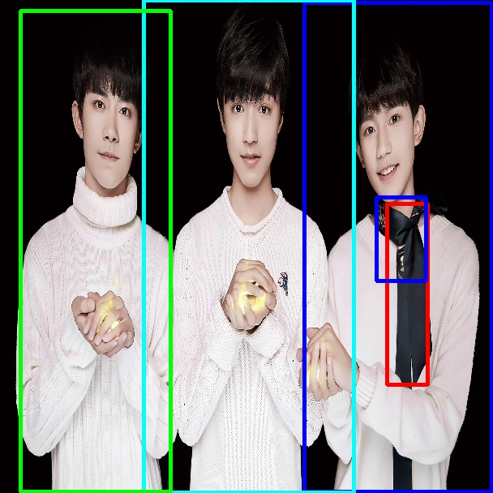
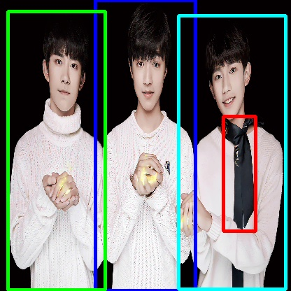
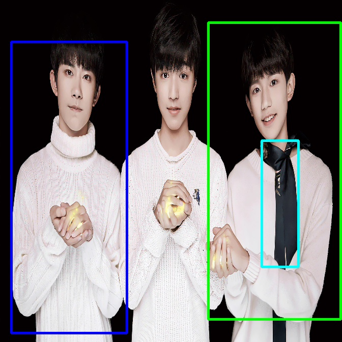
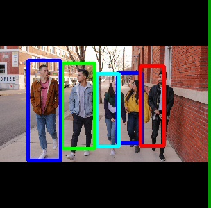
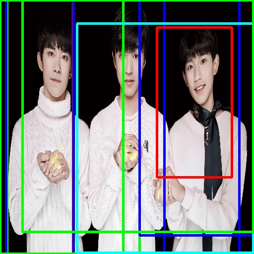
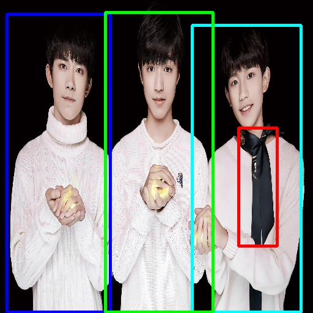
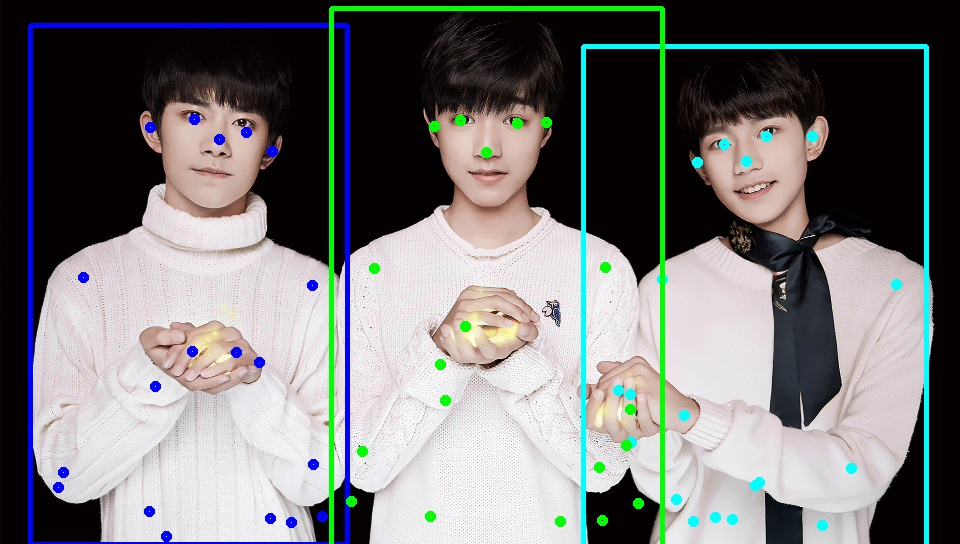
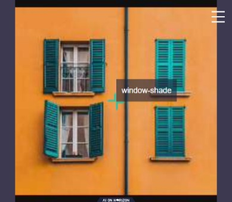
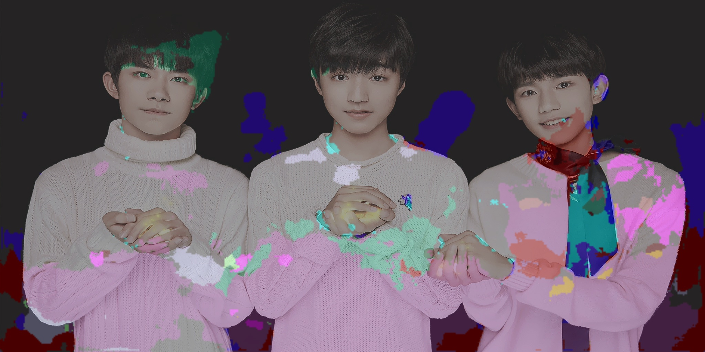
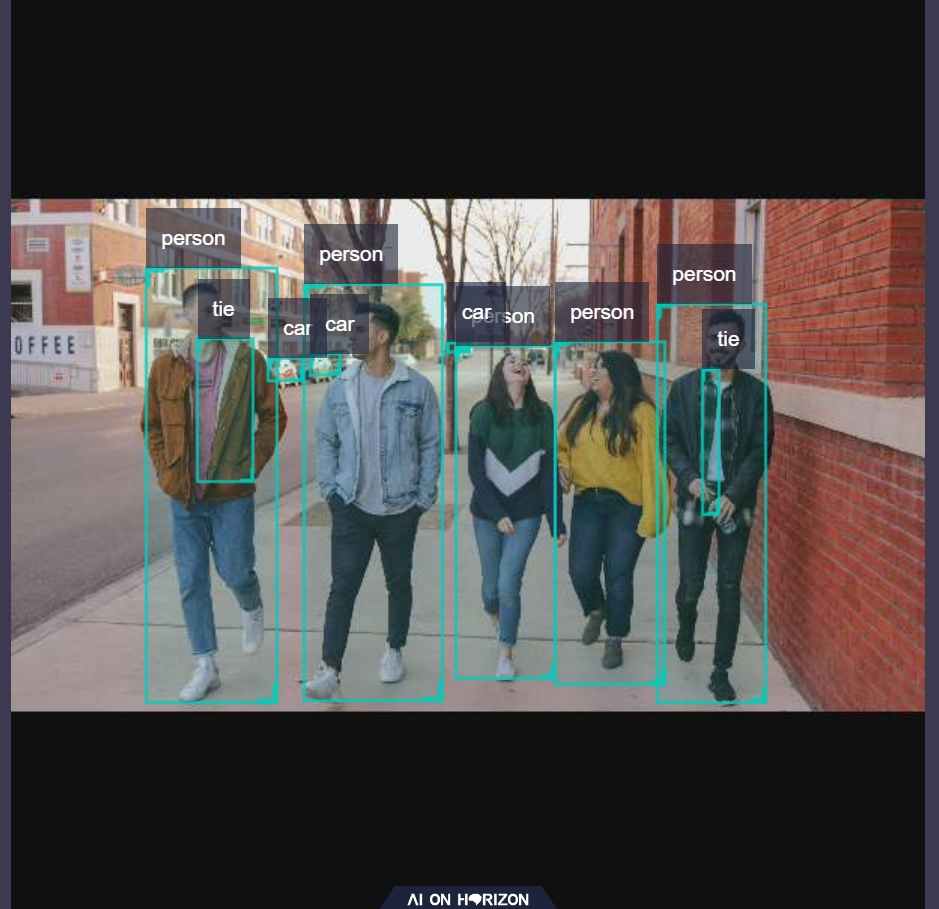

Getting Started with Dnn Node Example
=======


# 功能介绍

Dnn Node example package是Dnn Node package的使用示例，通过继承DnnNode虚基类，使用模型和图像数据利用BPU处理器进行模型推理。图像数据来源于本地图片回灌和订阅到的image msg。可通过配置文件使用dnn_node中内置的后处理算法，在dnn node example的后处理中发布智能结果，可通过web查看效果。

# 编译

## 依赖库

- opencv:3.4.5

ros package：

- dnn node
- cv_bridge
- sensor_msgs
- hbm_img_msgs
- ai_msgs
- hobot_cv

其中cv_bridge为ROS开源的package，需要手动安装，具体安装方法：

```cpp
# 方法1，直接使用apt安装，以cv_bridge安装举例
sudo apt-get install ros-foxy-cv-bridge -y

# 方法2，使用rosdep检查并自动安装pkg编译的依赖项
# 安装ros pkg依赖下载⼯具rosdep
sudo apt-get install python3-pip
sudo pip install rosdep
sudo rosdep init
rosdep update
# 在ros的⼯程路径下执⾏安装依赖，需要指定pkg所在路径。默认为所有pkg安装依赖，也可以指定为某个pkg安装依赖
rosdep install -i --from-path . --rosdistro foxy -y
```

hbm_img_msgs为自定义的图片消息格式，用于shared mem场景下的图片传输，hbm_img_msgs pkg定义在hobot_msgs中，因此如果使用shared mem进行图片传输，需要依赖此pkg。

## 开发环境

- 编程语言: C/C++
- 开发平台: X3/X86
- 系统版本：Ubuntu 20.0.4
- 编译工具链:Linux GCC 9.3.0/Linaro GCC 9.3.0

## 编译

支持在X3 Ubuntu系统上编译和在PC上使用docker交叉编译两种方式，并支持通过编译选项控制编译pkg的依赖和pkg的功能。

### 编译选项

1、CV_BRIDGE_PKG

- cv_bridge pkg依赖的使能开关，默认关闭（OFF），编译时使用-DCV_BRIDGE_PKG=ON命令打开。
- 如果打开，编译和运行会依赖cv_bridge pkg，支持使用订阅到的rgb8, bgr8和nv12格式图片进行模型推理。
- 如果关闭，编译和运行不依赖cv_bridge pkg，只支持使用订阅到的nv12格式图片进行模型推理。

2、SHARED_MEM

- shared mem（共享内存传输）使能开关，默认打开（ON），编译时使用-DSHARED_MEM=OFF命令关闭。
- 如果打开，编译和运行会依赖hbm_img_msgs pkg，并且需要使用tros进行编译。
- 如果关闭，编译和运行不依赖hbm_img_msgs pkg，支持使用原生ros和tros进行编译。
- 对于shared mem通信方式，当前只支持订阅nv12格式图片。

### X3 Ubuntu系统上编译

1、编译环境确认

- 板端已安装X3 Ubuntu系统。
- 当前编译终端已设置TogetherROS环境变量：`source PATH/setup.bash`。其中PATH为TogetherROS的安装路径。
- 已安装ROS2编译工具colcon。安装的ROS不包含编译工具colcon，需要手动安装colcon。colcon安装命令：`pip install -U colcon-common-extensions`
- 已编译dnn node package
- 已安装cv_bridge package（安装方法见Dependency部分）

2、编译

- 编译命令：`colcon build --packages-select dnn_node_example --cmake-args -DCV_BRIDGE_PKG=ON -DSHARED_MEM=OFF`
- 编译和运行会依赖cv_bridge pkg，不使用shared mem通信方式。支持使用订阅到的rgb8, bgr8和nv12格式图片进行模型推理。

### docker交叉编译

1、编译环境确认

- 在docker中编译，并且docker中已经安装好TogetherROS。docker安装、交叉编译说明、TogetherROS编译和部署说明详见机器人开发平台robot_dev_config repo中的README.md。
- 已编译dnn node package
- 已编译hbm_img_msgs package（编译方法见Dependency部分）

2、编译

- 编译命令：

  ```
  export TARGET_ARCH=aarch64
  export TARGET_TRIPLE=aarch64-linux-gnu
  export CROSS_COMPILE=/usr/bin/$TARGET_TRIPLE-

  colcon build --packages-select dnn_node_example \
     --merge-install \
     --cmake-force-configure \
     --cmake-args \
     --no-warn-unused-cli \
     -DCMAKE_TOOLCHAIN_FILE=`pwd`/robot_dev_config/aarch64_toolchainfile.cmake
  ```

- 编译选项中关闭了cv_bridge pkg依赖，打开了shared mem通信方式，只支持订阅nv12格式图片进行推理。

## 注意事项


# 使用介绍

## package说明
  源码包含**dnn_node_example package**，可通过配置文件配置使用dnn_node中内置的后处理算法，dnn_node中目前支持"yolov2","yolov3","yolov5","FasterRcnn","mobilenetv2","mobilenet_ssd","efficient_det","fcos","mobilenet_unet"等后处理算法。

## 依赖

- mipi_cam package：发布图片msg
- websocket package：渲染图片和ai感知msg

## 参数

| 参数名             | 解释                                  | 是否必须             | 默认值              | 备注                                                                    |
| ------------------ | ------------------------------------- | -------------------- | ------------------- | ----------------------------------------------------------------------- |
| feed_type          | 图片来源，0：本地；1：订阅            | 否                   | 0                   |                                                                         |
| image              | 本地图片地址                          | 否                   | config/test.jpg     |                                                                         |
| image_type         | 图片格式，0：bgr，1：nv12             | 否                   | 0                   |                                                                         |
| image_width        | 本地回灌nv12格式图片的宽度            | nv12格式图片必须设置 | 0                   |                                                                         |
| image_height       | 本地回灌nv12格式图片的高度            | nv12格式图片必须设置 | 0                   |                                                                         |
| is_shared_mem_sub  | 使用shared mem通信方式订阅图片        | 否                   | 0                   |                                                                         |
| config_file        | 配置文件路径                          | 否                   | ""                  | 更改配置文件配置不同模型调用不同后处理算法,默认启用fasterrcnn模型后处理 |
| dump_render_img    | 是否进行渲染，0：否；1：是            | 否                   | 0                   |                                                                         |
| msg_pub_topic_name | 发布智能结果的topicname,用于web端展示 | 否                   | hobot_dnn_detection |                                                                         |

## 运行

- dnn_node_example使用到的模型，保存在dnn_benchmark_example/config/runtime/下，运行时需要将runtime文件夹拷贝到dnn_node_example/config中，或在配置文件中重新指定模型路径。
- 编译成功后，将生成的install路径拷贝到地平线X3开发板上（如果是在X3上编译，忽略拷贝步骤），并执行如下命令运行。

## X3 Ubuntu系统上运行

```
export COLCON_CURRENT_PREFIX=./install
source ./install/local_setup.bash
# config中为example使用的模型，回灌使用的本地图片
# 根据实际安装路径进行拷贝（docker中的安装路径为install/lib/dnn_node_example/config/，拷贝命令为cp -r install/lib/dnn_node_example/config/ .）。
cp -r install/dnn_node_example/lib/dnn_node_example/config/ .
# 将dnn_node_example使用到的模型文件拷贝到config下。
cp -r PATH/lib/dnn_benchmark_example/config/runtime/ ./config (其中PATH为TogetherROS的安装路径)

# 运行模式1：
使用本地jpg格式图片通过同步模式进行回灌预测，并存储渲染后的图片
ros2 run dnn_node_example example --ros-args -p feed_type:=0 -p image:=config/test.jpg -p image_type:=0 -p dump_render_img:=1
配置使用yolov3模型和dnn_node中内置的yolov3后处理算法，使用本地jpg格式图片通过同步模式进行回灌预测，并存储渲染后的图片
ros2 run dnn_node_example example --ros-args -p feed_type:=0 -p image:=config/test.jpg -p image_type:=0 -p dump_render_img:=1 -p config_file:=config/yolov3workconfig.json

# 运行模式2：
使用订阅到的image msg(topic为/image_raw)通过异步模式进行预测，并设置log级别为warn
ros2 run dnn_node_example example --ros-args -p feed_type:=1 --ros-args --log-level warn
配置使用yolov2模型和dnn_node中内置的yolov2后处理算法，使用订阅到的image msg(topic为/image_raw)通过异步模式进行预测，并设置log级别为warn
ros2 run dnn_node_example example --ros-args -p feed_type:=1 --ros-args --log-level warn -p config_file:=config/yolov2workconfig.json

# 运行模式3：使用shared mem通信方式(topic为/hbmem_img)通过异步模式进行预测，并设置log级别为warn
ros2 run dnn_node_example example --ros-args -p feed_type:=1 -p is_shared_mem_sub:=1 --ros-args --log-level warn

```

运行方式2，使用launch文件启动：
```
export COLCON_CURRENT_PREFIX=./install
source ./install/setup.bash
# config中为示例使用的模型，根据实际安装路径进行拷贝
# 如果是板端编译（无--merge-install编译选项），拷贝命令为cp -r install/PKG_NAME/lib/PKG_NAME/config/ .，其中PKG_NAME为具体的package名。
cp -r install/lib/dnn_node_example/config/ .
# 将dnn_node_example使用到的模型文件拷贝到config下。
cp -r install/lib/dnn_benchmark_example/config/runtime/ ./config

# 启动launch文件，使用F37 sensor通过shared mem方式发布nv12格式图片
# 默认运行fcos算法，启动命令中使用参数config_file切换算法，如使用unet算法config_file:="config/mobilenet_unet_workconfig.json"
ros2 launch dnn_node_example hobot_dnn_node_example.launch.py
```

## X3 yocto系统上运行

```
export ROS_LOG_DIR=/userdata/
export LD_LIBRARY_PATH=${LD_LIBRARY_PATH}:./install/lib/

# config中为example使用的模型，回灌使用的本地图片
cp -r install/lib/dnn_node_example/config/ .

# 将dnn_node_example使用到的模型文件拷贝到config下。
cp -r PATH/lib/dnn_benchmark_example/config/runtime/ ./config (其中PATH为TogetherROS的安装路径)

# 运行模式1：使用本地jpg格式图片通过同步模式进行回灌预测，并存储渲染后的图片
./install/lib/dnn_node_example/example --ros-args -p  feed_type:=0 -p image:=config/test.jpg -p image_type:=0 -p dump_render_img:=1

# 运行模式2：使用订阅到的image msg(topic为/image_raw)通过异步模式进行预测，并设置log级别为warn
./install/lib/dnn_node_example/example --ros-args -p feed_type:=1 --log-level warn

# 运行模式3：使用shared mem通信方式(topic为/hbmem_img)通过异步模式进行预测，并设置log级别为warn
./install/lib/dnn_node_example/example --ros-args -p feed_type:=1 -p is_shared_mem_sub:=1 --ros-args --log-level warn

```

## 注意事项

- config_file配置文件格式为json格式，以yolov5模型配置为例，具体配置如下：
  {
    "model_file": "config/yolov5_672x672_nv12.bin",
    "model_name": "yolov5_672x672_nv12",
    "dnn_Parser": "yolov5",
    "model_output_count": 3
  }
  "model_file"为模型文件的路径。
  目前example支持的模型:
  | 模型名称                               | 模型类型 | 模型输出说明                             | 渲染效果                              |
  | -------------------------------------- | -------- | ---------------------------------------- | ------------------------------------- |
  | yolov2_608x608_nv12                    | 检测模型 | 输出检测到的物体和检测框                 |         |
  | yolov3_416x416_nv12                    | 检测模型 | 输出检测到的物体和检测框                 |         |
  | yolov5_672x672_nv12                    | 检测模型 | 输出检测到的物体和检测框                 |         |
  | mobilenet_ssd_300x300_nv12             | 检测模型 | 输出检测到的物体和检测框                 |  |
  | fcos_512x512_nv12                      | 检测模型 | 输出检测到的物体和检测框                 |           |
  | efficient_det_no_dequanti_512x512_nv12 | 检测模型 | 输出检测到的物体和检测框                 |  |
  | multitask_body_kps_960x544.hbm         | 检测模型 | 输出检测到body检测框和人体kps指标点      |       |
  | mobilenetv2_224x224_nv12.bin           | 分类模型 | 输出置信度最大的分类结果                 |    |
  | mobilenet_unet_1024x2048_nv12.bin      | 分割模型 | 语义分割，输出每个像素点对应其种类的图像 |           |

  "model_name"为模型名称
  "dnn_Parser"设置选择内置的后处理算法，目前支持的配置有"yolov2","yolov3","yolov5","kps_parser","classification","ssd","efficient_det","fcos","unet"。
  "model_output_count"为模型输出branch个数。

- 分割模型算法暂时只支持本地图片回灌，无web效果展示


# 结果分析

## X3结果展示

log：

运行命令：ros2 run dnn_node_example example --ros-args -p config_file:=config/yolov3workconfig.json -p dump_render_img:=1
```
[WARN] [1684542863.055571066] [example]: This is dnn node example!
[WARN] [1684542863.133229900] [example]: Parameter:
 feed_type(0:local, 1:sub): 0
 image: config/test.jpg
 image_type: 0
 dump_render_img: 1
 is_shared_mem_sub: 0
 model_file_name: config/runtime/yolov3/yolov3_416x416_nv12.bin
 model_name: yolov3_416x416_nv12
[INFO] [1684542863.149125191] [dnn]: Node init.
[INFO] [1684542863.149228733] [example]: Set node para.
[INFO] [1684542863.149285441] [dnn]: Model init.
[BPU_PLAT]BPU Platform Version(1.3.1)!
[HBRT] set log level as 0. version = 3.13.27
[DNN] Runtime version = 1.8.4_(3.13.27 HBRT)
[HorizonRT] The model builder version = 1.6.8
[000:000] (model.cpp:244): Empty desc, model name: yolov3_416x416_nv12, input branch:0, input name:data
[000:000] (model.cpp:313): Empty desc, model name: yolov3_416x416_nv12, output branch:0, output name:layer82-conv-transposed
[000:000] (model.cpp:313): Empty desc, model name: yolov3_416x416_nv12, output branch:1, output name:layer94-conv-transposed
[000:000] (model.cpp:313): Empty desc, model name: yolov3_416x416_nv12, output branch:2, output name:layer106-conv-transposed
[INFO] [1684542864.119252525] [dnn]: The model input 0 width is 416 and height is 416
[INFO] [1684542864.119363442] [example]: Set output parser.
[INFO] [1684542864.119542525] [dnn]: Task init.
[INFO] [1684542864.121412067] [dnn]: Set task_num [2]
[INFO] [1684542864.121486859] [example]: The model input width is 416 and height is 416
[INFO] [1684542864.121529775] [example]: Dnn node feed with local image: config/test.jpg
[INFO] [1684542866.023484026] [example]: task_num: 2
[INFO] [1684542866.200993943] [Yolo3Darknet_detection_parser]: dep out size: 3 3
[INFO] [1684542866.319497818] [example]: Output from image_name: config/test.jpg, frame_id: , stamp: 0.0
[INFO] [1684542866.319713068] [PostProcessBase]: outputs size: 3
[INFO] [1684542866.319767526] [PostProcessBase]: out box size: 11
[INFO] [1684542866.319839151] [PostProcessBase]: det rect: 300.004 68.3111 347.666 415, det type: person, score:0.999796
[INFO] [1684542866.319934693] [PostProcessBase]: det rect: 248.503 104.931 300.809 397.489, det type: person, score:0.999763
[INFO] [1684542866.320014818] [PostProcessBase]: det rect: 62.517 53.741 123.072 414.076, det type: person, score:0.999734
[INFO] [1684542866.320092193] [PostProcessBase]: det rect: 202.355 108.962 251.666 396.325, det type: person, score:0.999712
[INFO] [1684542866.320165276] [PostProcessBase]: det rect: 132.448 70.7646 196.075 415, det type: person, score:0.999361
[INFO] [1684542866.320286360] [PostProcessBase]: det rect: 117.439 129.264 130.877 152.227, det type: car, score:0.940759
[INFO] [1684542866.320360610] [PostProcessBase]: det rect: 201.869 117.786 210.163 130.43, det type: car, score:0.914081
[INFO] [1684542866.320433443] [PostProcessBase]: det rect: 125.557 124.45 149.921 149.43, det type: car, score:0.81808
[INFO] [1684542866.320505526] [PostProcessBase]: det rect: 173.927 125.132 184.199 136.716, det type: car, score:0.811718
[INFO] [1684542866.320589943] [PostProcessBase]: det rect: 143.016 121.023 156.819 143.535, det type: car, score:0.451065
[INFO] [1684542866.320663485] [PostProcessBase]: det rect: 235.168 120.715 242.281 131.487, det type: car, score:0.406651
[INFO] [1684542866.324350193] [ImageUtils]: target size: 11
[INFO] [1684542866.324494110] [ImageUtils]: target.rois.size: 1
[INFO] [1684542866.324536068] [ImageUtils]: roi.type:
[INFO] [1684542866.324574110] [ImageUtils]: roi x_offset: 300 y_offset: 68 width: 47 height: 346
[INFO] [1684542866.325962026] [ImageUtils]: target.rois.size: 1
[INFO] [1684542866.326007568] [ImageUtils]: roi.type:
[INFO] [1684542866.326044610] [ImageUtils]: roi x_offset: 248 y_offset: 104 width: 52 height: 292
[INFO] [1684542866.326231151] [ImageUtils]: target.rois.size: 1
[INFO] [1684542866.326270651] [ImageUtils]: roi.type:
[INFO] [1684542866.326306860] [ImageUtils]: roi x_offset: 62 y_offset: 53 width: 60 height: 360
[INFO] [1684542866.326534235] [ImageUtils]: target.rois.size: 1
[INFO] [1684542866.326573651] [ImageUtils]: roi.type:
[INFO] [1684542866.326609818] [ImageUtils]: roi x_offset: 202 y_offset: 108 width: 49 height: 287
[INFO] [1684542866.326794193] [ImageUtils]: target.rois.size: 1
[INFO] [1684542866.326833235] [ImageUtils]: roi.type:
[INFO] [1684542866.326868985] [ImageUtils]: roi x_offset: 132 y_offset: 70 width: 63 height: 344
[INFO] [1684542866.327076401] [ImageUtils]: target.rois.size: 1
[INFO] [1684542866.327115526] [ImageUtils]: roi.type:
[INFO] [1684542866.327151735] [ImageUtils]: roi x_offset: 117 y_offset: 129 width: 13 height: 22
[INFO] [1684542866.327214526] [ImageUtils]: target.rois.size: 1
[INFO] [1684542866.327252235] [ImageUtils]: roi.type:
[INFO] [1684542866.327374943] [ImageUtils]: roi x_offset: 201 y_offset: 117 width: 8 height: 12
[INFO] [1684542866.327435901] [ImageUtils]: target.rois.size: 1
[INFO] [1684542866.327473651] [ImageUtils]: roi.type:
[INFO] [1684542866.327509360] [ImageUtils]: roi x_offset: 125 y_offset: 124 width: 24 height: 24
[INFO] [1684542866.327573818] [ImageUtils]: target.rois.size: 1
[INFO] [1684542866.327611401] [ImageUtils]: roi.type:
[INFO] [1684542866.327647193] [ImageUtils]: roi x_offset: 173 y_offset: 125 width: 10 height: 11
[INFO] [1684542866.327704818] [ImageUtils]: target.rois.size: 1
[INFO] [1684542866.327742026] [ImageUtils]: roi.type:
[INFO] [1684542866.327777318] [ImageUtils]: roi x_offset: 143 y_offset: 121 width: 13 height: 22
[INFO] [1684542866.327839360] [ImageUtils]: target.rois.size: 1
[INFO] [1684542866.365547943] [ImageUtils]: roi.type:
[INFO] [1684542866.365588651] [ImageUtils]: roi x_offset: 235 y_offset: 120 width: 7 height: 10
[WARN] [1684542866.365663276] [ImageUtils]: Draw result to file: render__0_0.jpeg
[WARN] [1684542866.386982151] [example]: Smart fps = 1

```

渲染图片：

## web效果展示
本web效果采用的是yolov2的模型检测结果，启动流程如下：
```

1.启动图片发布节点：
ros2 run mipi_cam mipi_cam --ros-args -p out_format:=nv12 -p image_width:=608 -p image_height:=608 -p io_method:=shared_mem --log-level error &

2 启动jpeg图片编码&发布pkg
ros2 run hobot_codec hobot_codec_republish --ros-args -p channel:=1 -p in_mode:=shared_mem -p in_format:=nv12 -p out_mode:=ros -p out_format:=jpeg -p sub_topic:=/hbmem_img -p pub_topic:=/image_jpeg --ros-args --log-level error &

3 启动web展示pkg
ros2 run websocket websocket --ros-args -p image_topic:=/image_jpeg -p image_type:=mjpeg -p smart_topic:=/hobot_dnn_detection --log-level error &

5.使用订阅图片异步加载方式启动dnn_node_example
ros2 run dnn_node_example example --ros-args -p feed_type:=1 -p is_shared_mem_sub:=1 -p msg_pub_topic_name:=hobot_dnn_detection -p config_file:=config/yolov2workconfig.json
```

web效果截图：

