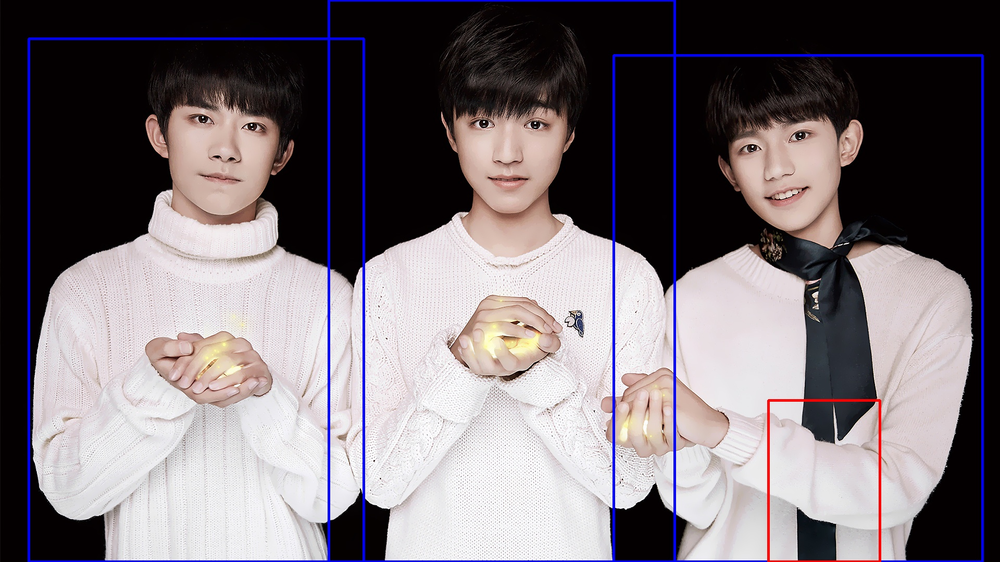
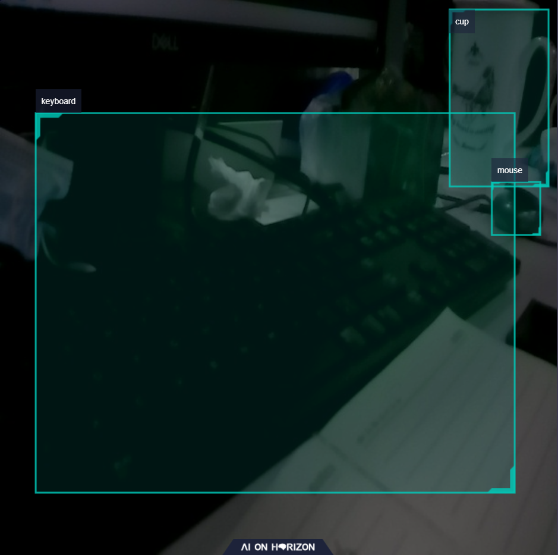

Getting Started with Dnn Node Example
=======


# 功能介绍

Dnn Node example package是Dnn Node package的使用示例，通过继承DnnNode虚基类，使用模型和图像数据利用BPU处理器进行模型推理。图像数据来源于本地图片回灌和订阅到的image msg。可通过配置文件使用dnn_node中内置的后处理算法，在dnn node example的后处理中发布智能结果，可通过web查看效果。

# 编译

## 依赖库

- dnn:1.8.4
- easydnn:0.3.3
- opencv:3.4.5
- hobotlog:1.0.5
- rapidjson:1.1.0

ros package：

- dnn node
- cv_bridge
- sensor_msgs
- hbm_img_msgs
- ai_msgs

其中cv_bridge为ROS开源的package，需要手动安装，具体安装方法：

```cpp
# 方法1，直接使用apt安装，以cv_bridge安装举例
sudo apt-get install ros-foxy-cv-bridge -y

# 方法2，使用rosdep检查并自动安装pkg编译的依赖项
# 安装ros pkg依赖下载⼯具rosdep
sudo apt-get install python3-pip
sudo pip install rosdep
sudo rosdep init
rosdep update
# 在ros的⼯程路径下执⾏安装依赖，需要指定pkg所在路径。默认为所有pkg安装依赖，也可以指定为某个pkg安装依赖
rosdep install -i --from-path . --rosdistro foxy -y
```

hbm_img_msgs为自定义的图片消息格式，用于shared mem场景下的图片传输，hbm_img_msgs pkg定义在hobot_msgs中，因此如果使用shared mem进行图片传输，需要依赖此pkg。

## 开发环境

- 编程语言: C/C++
- 开发平台: X3/X86
- 系统版本：Ubuntu 20.0.4
- 编译工具链:Linux GCC 9.3.0/Linaro GCC 9.3.0

## 编译

支持在X3 Ubuntu系统上编译和在PC上使用docker交叉编译两种方式，并支持通过编译选项控制编译pkg的依赖和pkg的功能。

### 编译选项

1、CV_BRIDGE_PKG

- cv_bridge pkg依赖的使能开关，默认关闭（OFF），编译时使用-DCV_BRIDGE_PKG=ON命令打开。
- 如果打开，编译和运行会依赖cv_bridge pkg，支持使用订阅到的rgb8, bgr8和nv12格式图片进行模型推理。
- 如果关闭，编译和运行不依赖cv_bridge pkg，只支持使用订阅到的nv12格式图片进行模型推理。

2、SHARED_MEM

- shared mem（共享内存传输）使能开关，默认打开（ON），编译时使用-DSHARED_MEM=OFF命令关闭。
- 如果打开，编译和运行会依赖hbm_img_msgs pkg，并且需要使用tros进行编译。
- 如果关闭，编译和运行不依赖hbm_img_msgs pkg，支持使用原生ros和tros进行编译。
- 对于shared mem通信方式，当前只支持订阅nv12格式图片。

### X3 Ubuntu系统上编译

1、编译环境确认

- 当前编译终端已设置ROS环境变量：`source /opt/ros/foxy/setup.bash`。
- 已安装ROS2编译工具colcon。安装的ROS不包含编译工具colcon，需要手动安装colcon。colcon安装命令：`apt update; apt install python3-colcon-common-extensions`
- 已编译dnn node package
- 已安装cv_bridge package（安装方法见Dependency部分）

2、编译

- 编译命令：`colcon build --packages-select dnn_node_example --cmake-args -DCV_BRIDGE_PKG=ON -DSHARED_MEM=OFF`
- 编译和运行会依赖cv_bridge pkg，不使用shared mem通信方式。支持使用订阅到的rgb8, bgr8和nv12格式图片进行模型推理。

### docker交叉编译

1、编译环境确认

- 在docker中编译，并且docker中已经安装好tros。docker安装、交叉编译说明、tros编译和部署说明详见机器人开发平台robot_dev_config repo中的README.md。
- 已编译dnn node package
- 已编译hbm_img_msgs package（编译方法见Dependency部分）

2、编译

- 编译命令：

  ```
  export TARGET_ARCH=aarch64
  export TARGET_TRIPLE=aarch64-linux-gnu
  export CROSS_COMPILE=/usr/bin/$TARGET_TRIPLE-

  colcon build --packages-select dnn_node_example \
     --merge-install \
     --cmake-force-configure \
     --cmake-args \
     --no-warn-unused-cli \
     -DCMAKE_TOOLCHAIN_FILE=`pwd`/robot_dev_config/aarch64_toolchainfile.cmake
  ```

- 编译选项中关闭了cv_bridge pkg依赖，打开了shared mem通信方式，只支持订阅nv12格式图片进行推理。

## 注意事项


# 使用介绍

## package说明
  源码包含**dnn_node_example package**，可通过配置文件配置使用dnn_node中内置的后处理算法，dnn_node中目前支持yolov2，yolov3和yolov5等检测模型的后处理算法。

## 依赖

- dnn_node package
- cv_bridge package
- sensor_msgs package
- hbm_img_msgs package

## 参数

| 参数名         | 解释         | 是否必须   | 默认值        | 备注         |
| ----------- | ---------- | ------ | ---------- | ---------- |
| feed_type | 图片来源，0：本地；1：订阅 | 否      | 0 |            |
| image      | 本地图片地址     | 否  |   config/test.jpg   |  |
| image_type | 图片格式，0：bgr，1：nv12 | 否  |  0   |  |
| is_sync_mode | 同步或异步模式 0: 异步 1: 同步| 否  |  1  |  |
| is_shared_mem_sub | 使用shared mem通信方式订阅图片 | 否  |  0   |  |
| config_file | 配置文件路径 | 否 | "" | 更改配置文件配置不同模型调用不同后处理算法,默认启用fasterrcnn模型后处理|
| dump_render_img | 是否进行渲染，0：否；1：是 | 否  |  0   |  |
| msg_pub_topic_name | 发布智能结果的topicname,用于web端展示 | 否  | hobot_dnn_detection |  |

## 运行

编译成功后，将生成的install路径拷贝到地平线X3开发板上（如果是在X3上编译，忽略拷贝步骤），并执行如下命令运行。

## X3 Ubuntu系统上运行

```
export COLCON_CURRENT_PREFIX=./install
source ./install/local_setup.bash
# config中为example使用的模型，回灌使用的本地图片
# 根据实际安装路径进行拷贝（docker中的安装路径为install/lib/dnn_node_example/config/，拷贝命令为cp -r install/lib/dnn_node_example/config/ .）。
cp -r install/dnn_node_example/lib/dnn_node_example/config/ .

# 运行模式1：
使用本地jpg格式图片通过同步模式进行回灌预测，并存储渲染后的图片
ros2 run dnn_node_example example --ros-args -p feed_type:=0 -p image:=config/test.jpg -p image_type:=0 -p dump_render_img:=1
配置使用yolov3模型和dnn_node中内置的yolov3后处理算法，使用本地jpg格式图片通过同步模式进行回灌预测，并存储渲染后的图片
ros2 run dnn_node_example example --ros-args -p feed_type:=0 -p image:=config/test.jpg -p image_type:=0 -p dump_render_img:=1 -p config_file:=config/yolov3workconfig.json

# 运行模式2：
使用订阅到的image msg(topic为/image_raw)通过异步模式进行预测，并设置log级别为warn
ros2 run dnn_node_example example --ros-args -p feed_type:=1 -p is_sync_mode:=0 --ros-args --log-level warn
配置使用yolov2模型和dnn_node中内置的yolov2后处理算法，使用订阅到的image msg(topic为/image_raw)通过异步模式进行预测，并设置log级别为warn
ros2 run dnn_node_example example --ros-args -p feed_type:=1 -p is_sync_mode:=0 --ros-args --log-level warn -p config_file:=config/yolov2workconfig.json

# 运行模式3：使用shared mem通信方式(topic为/hbmem_img)通过异步模式进行预测，并设置log级别为warn
ros2 run dnn_node_example example --ros-args -p feed_type:=1 -p is_sync_mode:=0 -p is_shared_mem_sub:=1 --ros-args --log-level warn

```

## X3 yocto系统上运行

```
export ROS_LOG_DIR=/userdata/
export LD_LIBRARY_PATH=${LD_LIBRARY_PATH}:./install/lib/

# config中为example使用的模型，回灌使用的本地图片
cp -r install/lib/dnn_node_example/config/ .

# 运行模式1：使用本地jpg格式图片通过同步模式进行回灌预测，并存储渲染后的图片
./install/lib/dnn_node_example/example --ros-args -p feed_type:=0 -p image:=config/test.jpg -p image_type:=0 -p dump_render_img:=1

# 运行模式2：使用订阅到的image msg(topic为/image_raw)通过异步模式进行预测，并设置log级别为warn
./install/lib/dnn_node_example/example --ros-args -p feed_type:=1 -p is_sync_mode:=0 --log-level warn

# 运行模式3：使用shared mem通信方式(topic为/hbmem_img)通过异步模式进行预测，并设置log级别为warn
./install/lib/dnn_node_example/example --ros-args -p feed_type:=1 -p is_sync_mode:=0 -p is_shared_mem_sub:=1 --ros-args --log-level warn

```

## 注意事项

config_file配置文件格式为json格式，以yolov5模型配置为例，具体配置如下：

{
  "model_file": "config/yolov5_672x672_nv12.bin",
  "model_name": "yolov5_672x672_nv12",
  "dnnParser": "yolov5",
  "model_output_count": 3
}

"model_file"为模型文件的路径，目前example支持的模型有yolov2_608x608_nv12.bin，yolov3_416x416_nv12.bin，yolov5_672x672_nv12.bin，multitask_body_kps_960x544.hbm。
"model_name"为模型名称
"dnnParser"设置选择内置的后处理算法，目前支持的配置有"yolov2","yolov3","yolov5","kps_parser"。
"model_output_count"为模型输出branch个数。

# 结果分析

## X3结果展示

log：

```
root@ubuntu:~/hobot_dnn/dnn_node_example# ros2 run dnn_node_example example --ros-args -p config_file:=config/yolov3workconfig.json -p dump_render_img:=1
[WARN] [1650811880.359277035] [example]: This is dnn node example!
[WARN] [1650811880.467918660] [example]: Parameter:
 feed_type(0:local, 1:sub): 0
 image: config/test.jpg
 image_type: 0
 dump_render_img: 1
 is_sync_mode_: 1
 is_shared_mem_sub: 0
 model_file_name: config/yolov3_416x416_nv12.bin
 model_name: yolov3_416x416_nv12
 output_index: 2
[INFO] [1650811880.488089160] [dnn]: Node init.
[INFO] [1650811880.488226994] [example]: Set node para.
[INFO] [1650811880.488310035] [dnn]: Model init.
[BPU_PLAT]BPU Platform Version(1.3.1)!
[HBRT] set log level as 0. version = 3.13.27
[DNN] Runtime version = 1.8.4_(3.13.27 HBRT)
[HorizonRT] The model builder version = 1.6.8
[000:000] (model.cpp:244): Empty desc, model name: yolov3_416x416_nv12, input branch:0, input name:data
[000:001] (model.cpp:313): Empty desc, model name: yolov3_416x416_nv12, output branch:0, output name:layer82-conv-transposed
[000:001] (model.cpp:313): Empty desc, model name: yolov3_416x416_nv12, output branch:1, output name:layer94-conv-transposed
[000:001] (model.cpp:313): Empty desc, model name: yolov3_416x416_nv12, output branch:2, output name:layer106-conv-transposed
[INFO] [1650811881.764617619] [dnn]: The model input 0 width is 416 and height is 416
[INFO] [1650811881.764727411] [example]: Set output parser.
[INFO] [1650811881.764908536] [dnn]: Task init.
[INFO] [1650811881.766740453] [dnn]: Set task_num [2]
[INFO] [1650811881.766807953] [example]: The model input width is 416 and height is 416
[INFO] [1650811881.766849744] [example]: Dnn node feed with local image: config/test.jpg
[INFO] [1650811882.016814620] [example]: task_num: 2
[INFO] [1650811882.204129578] [Yolo3Darknet_detection_parser]: dep out size: 3 3
[INFO] [1650811882.326904578] [example]: Output from image_name: config/test.jpg
[INFO] [1650811882.327009203] [example]: outputs size: 3
[WARN] [1650811882.327049911] [example]: Smart fps = 1
[INFO] [1650811882.327092161] [example]: out box size: 4
[INFO] [1650811882.327157661] [example]: det rect: 136.913 0 280.783 416, det type: person, score:0.997719
[INFO] [1650811882.327248453] [example]: det rect: 255.371 22.9813 408.713 414.511, det type: person, score:0.996967
[INFO] [1650811882.327374036] [example]: det rect: 11.9685 16.1961 151.39 416, det type: person, score:0.992555
[INFO] [1650811882.327451661] [example]: det rect: 319.664 166.759 366.138 331.261, det type: tie, score:0.746545
[INFO] [1650811882.543994453] [example]: Draw result to file: render.jpg
```

渲染图片：

## web效果展示
本web效果采用的是yolov2的模型检测结果，启动流程如下：
```

1.启动图片发布节点：ros2 run mipi_cam mipi_cam --ros-args -p video_device:=F37 -p out_format:=nv12 -p io_method:=hbmem -p image_width:=608 -p image_height:=608 --log-level warn

2.使用订阅图片异步加载方式启动dnn_parser_node节点：ros2 run dnn_node_example example --ros-args -p feed_type:=1 -p is_sync_mode:=0 -p config_file:=config/yolov2workconfig.json --ros-args --log-level warn

3.进入hobot_websocket/install/websocket/lib/websocket/webservice
4.启动nginx：
	chmod +x ./sbin/nginx
	./sbin/nginx -p .

5. 启动websocket：ros2 run websocket websocket --ros-args -p image_width:=608 -p image_height:=608 -p smart_topic:=hobot_dnn_detection -p smart_width:=608 -p smart_height:=608
```

web效果截图：

