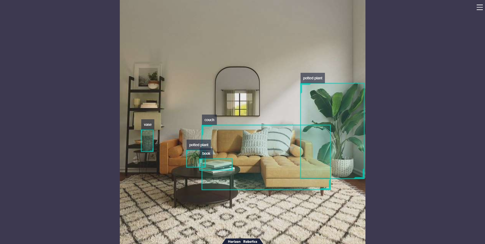

English| [简体中文](./README_cn.md)

Getting Started with Dnn Node Sample
=======


# Introduction

The Dnn Node sample package is an example of using the Dnn Node package. By inheriting the DnnNode virtual base class, it utilizes the YOLOv5 model and image data to perform algorithm inference on a BPU processor.

The image data comes from subscribed image data messages, supporting image data published using MIPI/USB cameras and local images. After the inference is completed, a custom algorithm output parsing method is used to parse the algorithm's output tensor. Once parsed, the intelligent results are published, and real-time rendering effects can be viewed through a web interface.

# Development Environment

- Programming Language: C/C++
- Development Platform: X3/X86
- System Version: Ubuntu 20.04/Ubuntu 22.04
- Compiler Toolchain: Linux GCC 9.3.0/Linaro GCC 9.3.0

# Compilation

- X3 Version: Supports compilation on X3 Ubuntu system and cross-compilation on PC using Docker.
- X86 Version: Supports compilation on X86 Ubuntu system.
Compilation dependencies and package functionalities can be controlled through compilation options.

## Compilation on X3 Ubuntu System for X3 Version

1. Confirm Compilation Environment

- X3 Ubuntu system is installed on the board.
- The current compilation terminal has set the TROS environment variable: `source /opt/tros/setup.bash`.
- ROS2 software package build system ament_cmake is installed. Installation command: `apt update; apt-get install python3-catkin-pkg; pip3 install empy`.
- ROS2 compile tool colcon is installed. Installation command: `pip3 install -U colcon-common-extensions`.

2. Compilation

- Compilation command: `colcon build --packages-select dnn_node_sample`

## Docker Cross-Compilation for X3 Version

1. Confirm Compilation Environment

- Compile in Docker environment, and TROS is already compiled in Docker. For detailed instructions on Docker installation, cross-compilation, TROS compilation, and deployment, please refer to the [Horizon Robotics Platform User Manual](https://developer.horizon.ai/api/v1/fileData/TogetherROS/quick_start/cross_compile.html#togetherros).

2. Compilation

- Compilation command:

```shell```shell
export TARGET_ARCH=aarch64
export TARGET_TRIPLE=aarch64-linux-gnu
export CROSS_COMPILE=/usr/bin/$TARGET_TRIPLE-

colcon build --packages-select dnn_node_sample \
   --merge-install \
   --cmake-force-configure \
   --cmake-args \
   --no-warn-unused-cli \
   -DCMAKE_TOOLCHAIN_FILE=`pwd`/robot_dev_config/aarch64_toolchainfile.cmake
```  

# Instructions for Use

## Running on X3 Ubuntu System

Including image message publishing and web display.

**Publishing Images Using F37 MIPI Camera**

```shell
# Set up the TogetherROS environment
source /opt/tros/setup.bash

# Copy models and sample images to the working directory
cp -r /opt/tros/${TROS_DISTRO}/lib/dnn_node_sample/config/ .

# Configure the MIPI camera
export CAM_TYPE=mipi

ros2 launch dnn_node_sample dnn_node_sample.launch.py 
```

**Publishing Images Using USB Camera**

```shell
# Set up the TogetherROS environment
source /opt/tros/setup.bash

# Copy models and sample images to the working directory
cp -r /opt/tros/${TROS_DISTRO}/lib/dnn_node_sample/config/ .

# Configure the USB camera
export CAM_TYPE=usb

ros2 launch dnn_node_sample dnn_node_sample.launch.py 
```

**Injecting Local Images**```shell
# Setup TogetherROS environment
source /opt/tros/setup.bash

# Copy models and feedback images to the running directory
cp -r /opt/tros/${TROS_DISTRO}/lib/dnn_node_sample/config/ .

# Configure local image feedback
export CAM_TYPE=fb

# The local image used is /opt/tros/${TROS_DISTRO}/lib/dnn_node_sample/config/target.jpg
ros2 launch dnn_node_sample dnn_node_sample.launch.py
```

## Notes

1. Switching MIPI camera type

The default MIPI camera type is `F37`, you can modify the `video_device` configuration in the `mipi_node` section of the launch script to change the camera type. The supported configurations are `F37` and `GC4663`.

2. Modifying the feedback image

The default feedback image is `/opt/tros/${TROS_DISTRO}/lib/dnn_node_sample/config/target.jpg`, you can modify the `image_source` configuration in the `fb_node` section of the launch script to change the feedback image.

# Results Analysis

Illustration using local image feedback.

## X3 Result Display

Execute the following command:

```bash
root@ubuntu:~# source /opt/tros/setup.bash
root@ubuntu:~# export CAM_TYPE=fb
root@ubuntu:~# ros2 launch dnn_node_sample dnn_node_sample.launch.py
```

Log Output:

```text
[INFO] [launch]: All log files can be found below /root/.ros/log/2022-09-20-12-47-57-043477-ubuntu-4390
[INFO] [launch]: Default logging verbosity is set to INFO
camera_type is  fb
using feedback
webserver has launch
[INFO] [hobot_image_pub-1]: process started with pid [4396]
[INFO] [hobot_codec_republish-2]: process started with pid [4398]
[INFO] [dnn_node_sample-3]: process started with pid [4400]
[INFO] [websocket-4]: process started with pid [4402]
```[dnn_node_sample-3] [C][4400][09-20][12:47:58:604][configuration.cpp:49][EasyDNN]EasyDNN version: 0.4.11
[dnn_node_sample-3] [BPU_PLAT]BPU Platform Version(1.3.1)!
[dnn_node_sample-3] [HBRT] set log level as 0. version = 3.14.5
[dnn_node_sample-3] [DNN] Runtime version = 1.9.7_(3.14.5 HBRT)
[dnn_node_sample-3] [WARN] [1663649278.801689569] [dnn]: Run default SetOutputParser.
[dnn_node_sample-3] [WARN] [1663649278.802293300] [dnn]: Set output parser with default dnn node parser, you will get all output tensors and should parse output_tensors in PostProcess.
[dnn_node_sample-3] [WARN] [1663649280.115318280] [dnn_node_sample]: input fps: 11.49, out fps: 11.64, infer time ms: 65, post process time ms: 78
[dnn_node_sample-3] [WARN] [1663649281.120420769] [dnn_node_sample]: input fps: 11.49, out fps: 9.98, infer time ms: 67, post process time ms: 81
[dnn_node_sample-3] [WARN] [1663649282.217524812] [dnn_node_sample]: input fps: 10.00, out fps: 9.97, infer time ms: 71, post process time ms: 74
[dnn_node_sample-3] [WARN] [1663649283.318315410] [dnn_node_sample]: input fps: 10.00, out fps: 10.00, infer time ms: 71, post process time ms: 74
[dnn_node_sample-3] [WARN] [1663649284.320494664] [dnn_node_sample]: input fps: 10.00, out fps: 9.99, infer time ms: 72, post process time ms: 76

The log shows that both the frame rates of subscribing image messages and publishing AI messages are around 10fps, with the algorithm taking about 70 milliseconds for single-frame inference and about 78 milliseconds for output parsing.

## Web Effect Display

Web effect screenshot:



Detected target bounding boxes and categories are rendered.